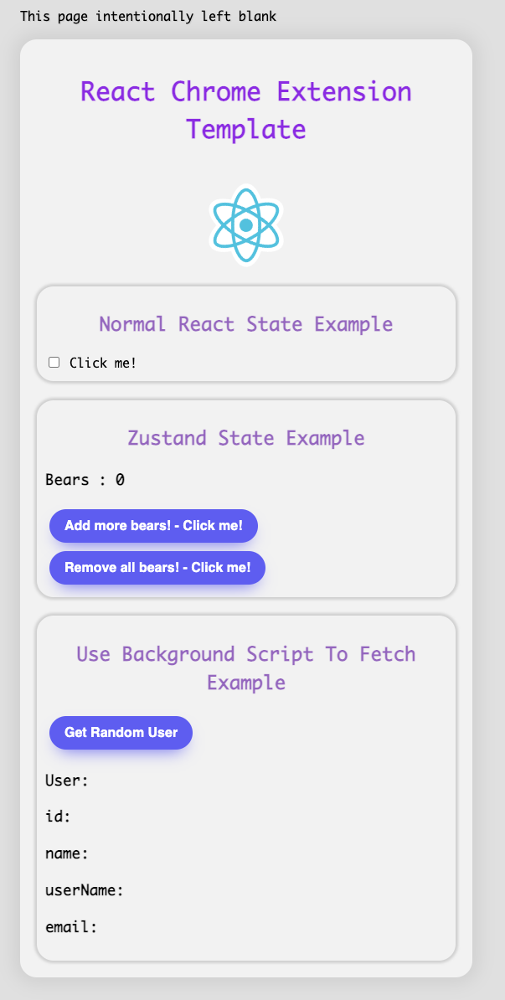

# TongueTuner for YouTube

Enhance and vocalize YouTube subtitles with TongueTuner. This extension smartly refines auto-generated subtitles, adds punctuation, and uses advanced TTS for a seamless viewing experience.


This project uses [Vite](https://vitejs.dev/) and [crxjs](https://crxjs.dev/vite-plugin) to build the extension.

## Features added

- Background Scripts - React components can communicate with the background scripts and react to fetched data.
- State Management - Context and Zustand.
- Chokidar - Allows the files to be watched and for the transpiler to run on any changes
- Path Aliases - Allows use of `@components/App` instead of `"../../Components/App"`

Why Zustand? Its quick and easy to get up and running, strip it you dont want it.

Why Context? I am using this to receive background script messages and update that zustand stores with that data. This is what allows the components to be react. You could do this all with vanilla zustand but I wanted to keep the zustand hooks. I also wanted to keep the `chrome.runtime.sendMessage` logic out of the other components and just have them consume the stores / context.
Note: I have done this to keep it relivitely simple to get started. You can definitely just use custom hooks. If you would like to see a more advanced exmaple please check out this repo [Real Estate Mate](https://github.com/RickWillcox/Real-Estate-Mate). I my update this repo after I have finished that extension I just linked with updates based on what I learned.

## What you will be greated with upon installation




## Setup

### Clone repository

```sh
 git clone https://github.com/maxbsoft/tongue-tuner-for-youtube-chrome-extension
```

### Install dependencies

```sh
yarn
```

### Build extension

```
yarn build
```

### Build and rebuild on file save

```
yarn watch
```

### Load extension

1. Navigate to [chrome://extensions/](chrome://extensions/)
1. Turn on the "Developer mode" toggle switch in the top right of the window
1. Click the "Load unpacked" button in top left of the window
1. Go to the `tongue-tuner-for-youtube-chrome-extension` directory and select the `dist` directory to load the extension
1. Navigate to [This Page](https://this-page-intentionally-left-blank.org/) to see the React Typescript Chrome Extension Template app in action!


### Thank you so much for the template 

- [React TypeScript Chrome Extension Template](https://github.com/RickWillcox/react-typescript-chrome-extension-template)

- [React-Content-Script](https://github.com/yosevu/react-content-script)
